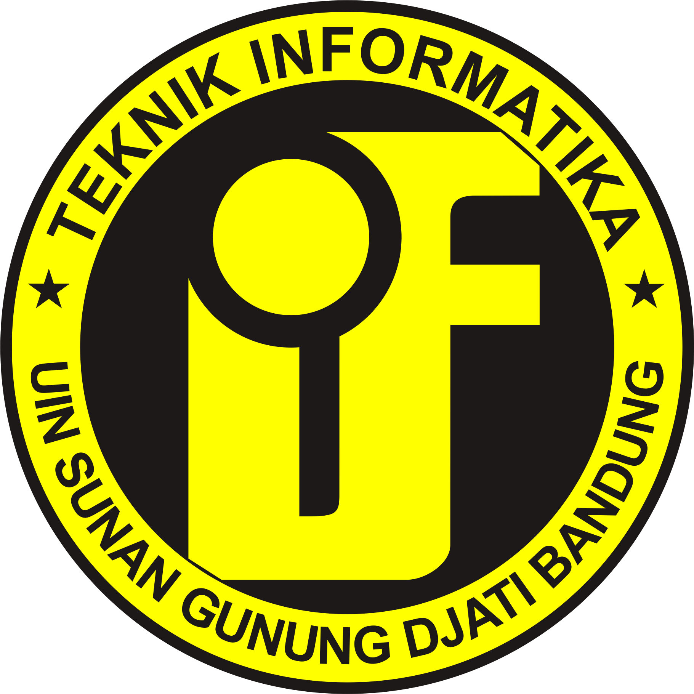
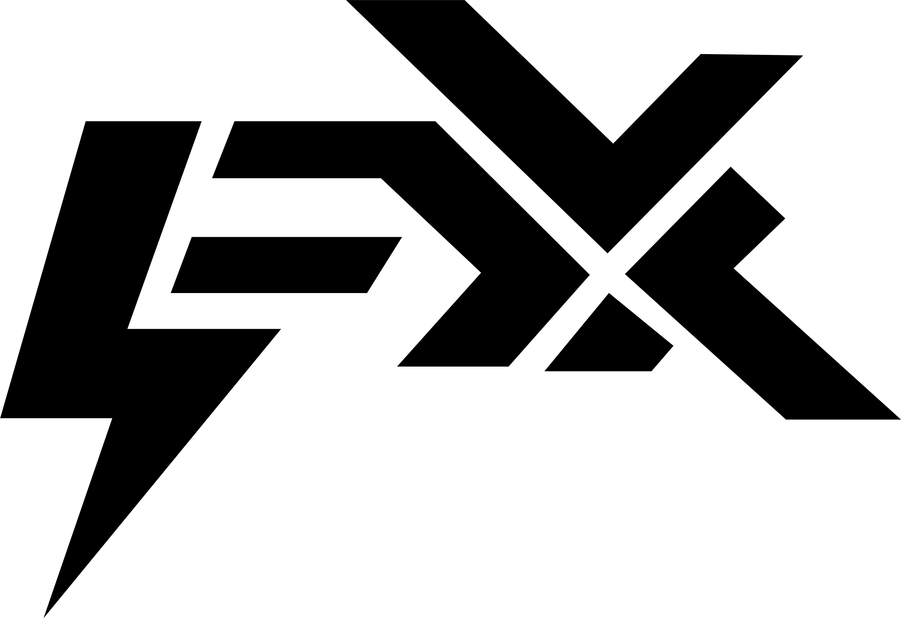
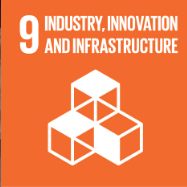

# UIN and IF Logo:

# EleXclusiv 
 

EleXlusif is a specialized platform designed to modernize and digitize electrical shops, enabling them to thrive in the online market. By leveraging the latest technology, this system empowers shop owners to expand their market reach and enhance the visibility of their products. Its features include inventory management, easy purchasing and payment processes, and robust data protection. With EleXlusif, electrical shops can optimize their operations and achieve success in the digital era. 

### Related SDGs Icons:

# Proposal Design 
- https://drive.google.com/drive/folders/1ZBKqZjC7t_YIbmc1ybfWQbJJaV9RGClc?usp=sharing

# Short Promotional Video
- https://www.instagram.com/reel/C680gZES1N1/?igsh=bTFpZnE2azB6eTZi

## Team Members:
- Mochammad Rizky Ramadhani - 1217050081
- Muhammad Dzikri - 121705009
- Muhammad Nuzul Rizqa  - 1217050100
- Muhammad Zidan Fauzi - 1217050106
